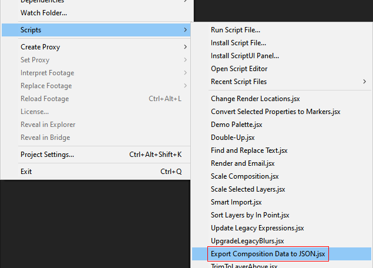
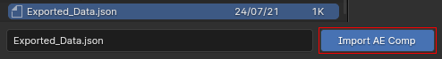

# after-effects-to-blender-export

This repo includes a script for After Effects, and add-on for Blender, that allows animated composition layer data to be exported from the former to the latter.

## Installation / Usage (After Effects)

To install the After Effects script, first [download it](https://github.com/adroitwhiz/after-effects-to-blender-export/raw/master/Export%Composition%20Data%20to%20JSON.jsx) and then select it via File > Scripts > Install Script File...:


You'll need to restart After Effects after installing it.

Make sure that "Allow Scripts to Write Files and Access Network" is enabled:


To use the script, you must first make sure you're in the Composition view:


Then run the script:



## After Effects Script Options

When you run the script, a dialog box will appear:


The settings are as follows:

#### Save to
Choose the destination of the exported composition data file. This file can then be imported into Blender.

#### Time range
Some animated properties, and properties controlled via expressions, have keyframes that cannot be directly imported into Blender, and they must be "baked" in After Effects, meaning that the property's value is calculated once per frame. This setting controls the time range that the keyframes will be generated over.
- "Whole comp": keyframes will be generated for the entire duration of the composition.
- "Work area": keyframes will only be generated within the composition's work area.
- "Layer duration": keyframes will only be generated within the duration(s) of the exported layer(s).

#### Export selected layers only
When checked, this ensures that only the layers you select will be exported. If "Bake transforms" is not checked, the selected layers' parents will be imported as well even if they aren't selected, in order to ensure that the child layers are properly transformed.

#### Bake transforms
When checked, all layer transforms will be "baked" in After Effects instead of being imported keyframes-and-all into Blender. In case of a bug in the importer, complicated scenarios (like a 3D layer parented to a 2D layer parented to a 3D layer), or unimplemented features (like Auto-Orient), this may be necessary.

#### Comp camera is centered

If checked, the exporter will treat the center of the After Effects composition (half its width and height) as the 3D origin. This matches the Cineware option for using a centered comp camera, and if you select that option, you should check this box:


## Installation / Usage (Blender)

To install the Blender add-on, [download](https://github.com/adroitwhiz/after-effects-to-blender-export/raw/master/import-comp-to-blender.py), install, and then enable it via the add-on preferences:


To import camera data exported from After Effects, navigate to File > Import > After Effects composition data, converted (.json):


There are several import options on the righthand pane of the file dialog:


#### Scale Factor
This is the factor by which all units in the imported composition will be scaled. The default value, 0.01, maps one pixel to one centimeter, which matches Cinema 4D.

#### Comp Center to Origin
If checked, this will position objects relative to Blender's origin rather than the composition center (which is down and to the right of Blender's origin).

This matches the Cineware option for using a centered comp camera, and you should check this box if you select that option:


#### Use Comp Resolution
If checked, this will set the scene's render resolution to the resolution of the imported composition.

#### Create New Collection
If checked, this will place all imported objects into a new collection.

#### Adjust Frame Start/End
If checked, this will adjust the "Start"/"End" frame range in the timeline to the imported composition's work area.

Once the desired options have been set, navigate to the .json file exported via the After Effects script, and click Import AE Comp:


## Development

If a script file depends on other script files, After Effects' "Install Script File" option will not work. To get around this, I've created a preprocessor script that lives in `util/preprocess.py`. To use it, simply run it via Python:

```bash
python3 util/preprocess.py
```

Or if you're on Windows:
```powershell
py -3 util\preprocess.py
```

This will generate `Export Composition Data to JSON.jsx`.

If you're working on the script, you don't need to re-preprocess the file every time you make a change--the `@include` directives are also recognized by After Effects itself. Simply run the script file located in `export-comp-from-ae` via File > Scripts > Run Script File.

## Roadmap

- Import options:
    - Toggle flip of Y/Z axes
    - Framerate:
        - Set Blender framerate to comp framerate
        - Maintain frame numbers
        - Remap comp framerate to Blender framerate

- After Effects features:
    - Pixel aspect ratio (AE expands horizontally, Blender crops vertically according to "Sensor Fit")
    - Nested 3D compositions
    - Images/videos as planes
    - Lights
    - Material options
    - Text layers
    - Shape layers
    - Opacity
    - Convert layer in/out points to Disable in Viewport/Render keyframes

- Transforms:
    - 3D layer -> 2D layer -> 3D layer parent chain loses Z-transforming properties
    - Remove unanimated anchor points especially on null layers
    - Auto-Orient